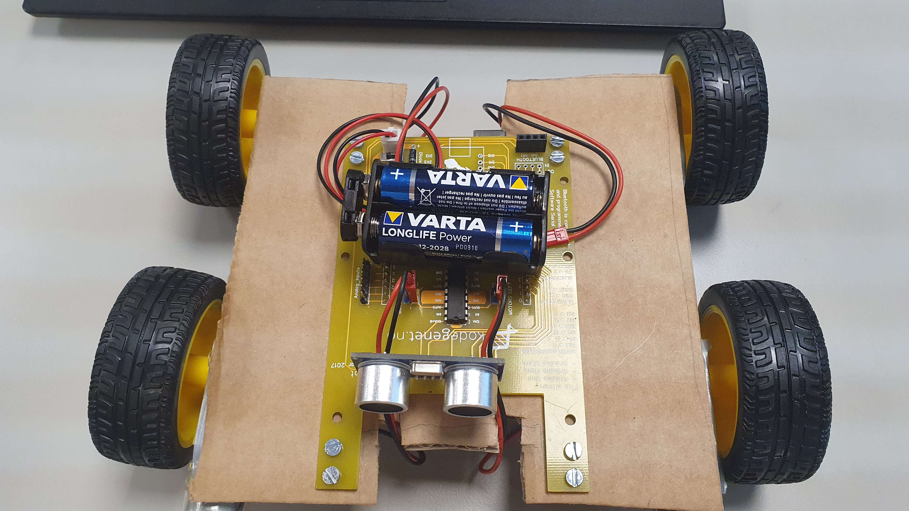
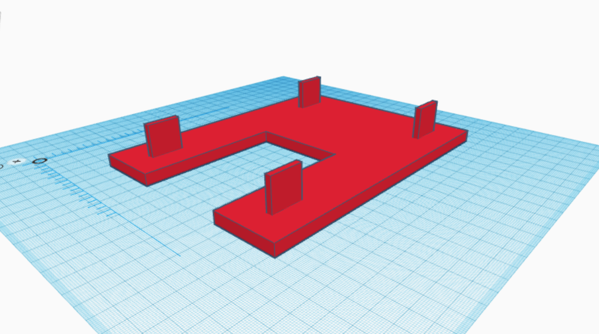

## Dokumentasjon av Arduino prosjektet

### Introduksjon
I dette dokumentet skal jeg dokumentere Arduino prosjektet jeg har jobbet med de siste ukene

Vi har jobbet med mikrokontrolleren Arduino og koblet den til ulike komponenter for å styre de.

#### Liste med filer
[arduino_prosjekt.ino](arduino_prosjekt.ino)

### arduino_prosjekter.ino
Dette er filen som inneholder koden for arduinoen som kontrollerer servoene og sensoren

Her definerer jeg pins jeg skal bruke til ultralyd-sensoren

    #define echoPin 3	
    #define trigPin 2
    #define ena 11

Her definerer jeg pins jeg skal bruke for å kontrollere motorene

    #define in1 13 
    #define in2 12
    #define in3 8
    #define in4 9
    
Definerer variablen airspeed som er lufthastigheten oppgitt i cm per mikrosekund

    float airspeed = 0.034;
    
Deklarer variablene Duration og Distance som blir brukt senere i beregninger

Videre vil Duration ha enhet mikrosekund og Distance ha enhet centimeter

    float duration,distance;

Dette er løkken som blir kjørt før hovedløkken. I denne løkken definerer vi hvilke pins som skal ta imot input og hvilke som skal gi output.

Her initialiserer det også startet en seriell kobling mellom arduinoen og pcen via USB for kommunikasjon

    void setup() {
    pinMode(echoPin, INPUT);
    pinMode(trigPin, OUTPUT);
    Serial.begin(9600);
    pinMode(ena, OUTPUT);
    pinMode(in1, OUTPUT);
    pinMode(in2, OUTPUT);
    pinMode(in3, OUTPUT);
    pinMode(in4, OUTPUT);
    }

Dette er hovedløkken

Her blir de ulike komponentene styrt

    //Hovedløkken som kjører
    void loop() {
    //Finner distansen fra sensoren og objektet.
    digitalWrite(trigPin, LOW);
    delayMicroseconds(5);
    digitalWrite(trigPin, HIGH);
    delayMicroseconds(10);
    digitalWrite(trigPin, LOW);
    duration = pulseIn(echoPin, HIGH); //mikrosekunder
    distance = airspeed * duration/2; //Beregner avstand
    Serial.println(String(distance)+" cm");
    
    delay(100); //Venter 100 millisekund
    int v = 200; // Definerer den elektriske spenningen til motoren.
    //definerer motorstyring, her vil v være et tall fra 0 til 255 hvor 0 gir 0 volt og 255 gir 5 volt
    analogWrite(ena,v); 
    analogWrite(enb,v);
    //Definerer retningen til motorene
    digitalWrite(in1,HIGH);
    digitalWrite(in2,LOW);
    digitalWrite(in3,HIGH);
    digitalWrite(in4,LOW);
    }
    

### Bilde
Dette er den første prototypen av arduino-prosjektet. Arduinoen og motoroene er festet til en papp plate

Senere har vi valgt å oppgradere platen til en 3D printet modell.
Her er [3D-modellen](https://www.tinkercad.com/things/gJdijRCY9h9?sharecode=v7eFE0kEtUtW2Mtntz1nox337_5QEP9RUbmisWngXZM) jeg lagde:

